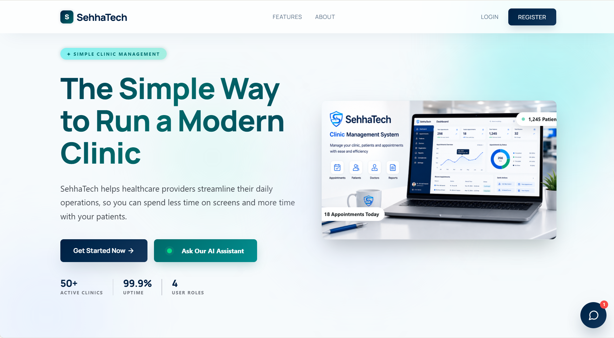
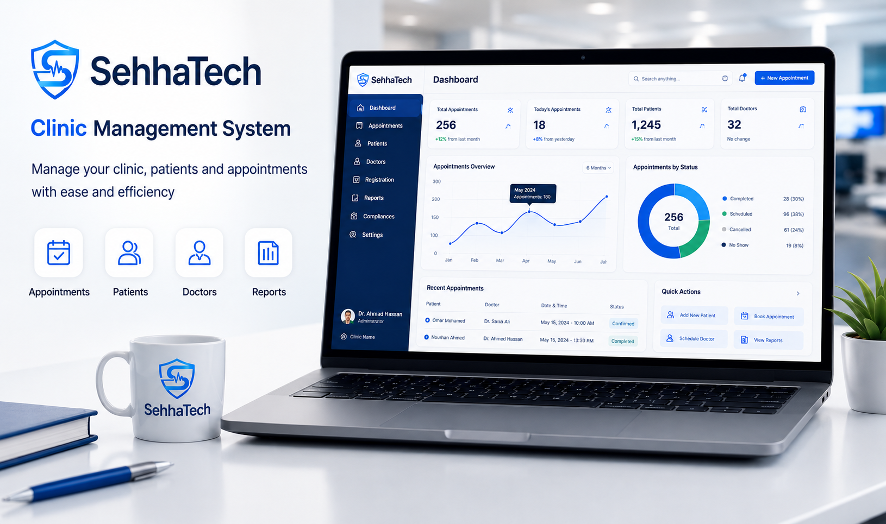
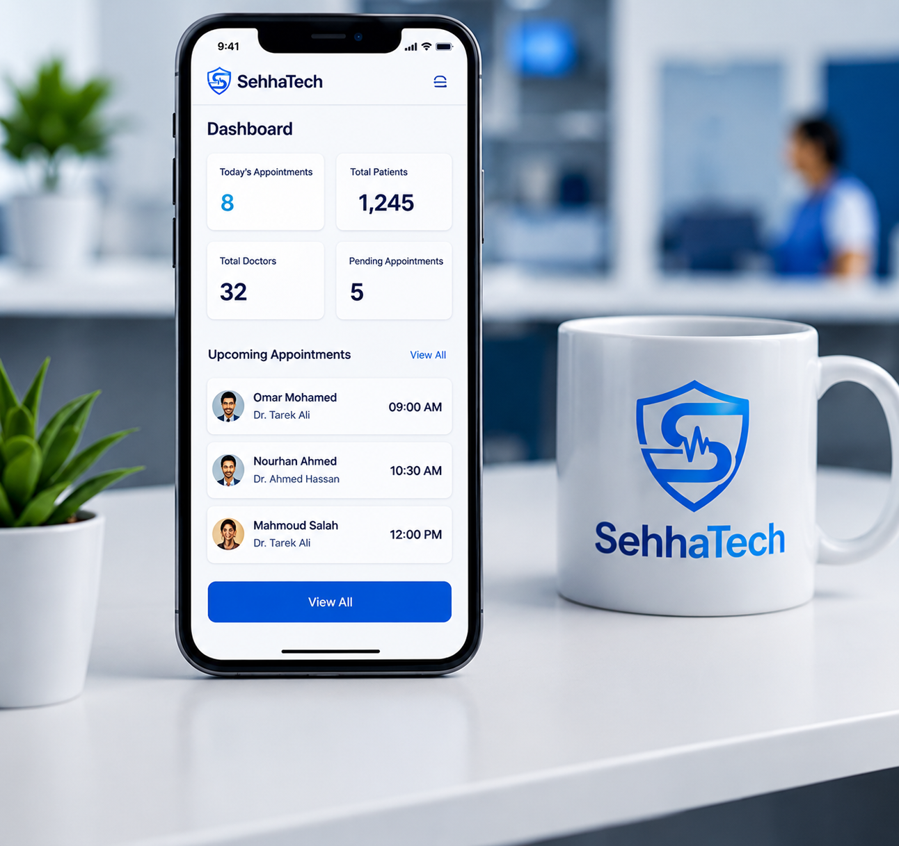
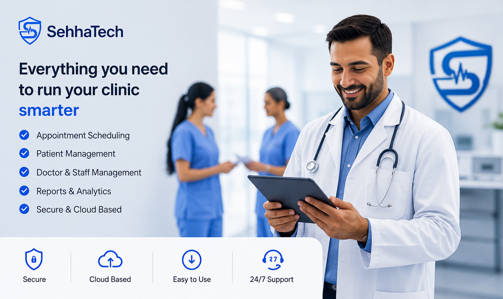
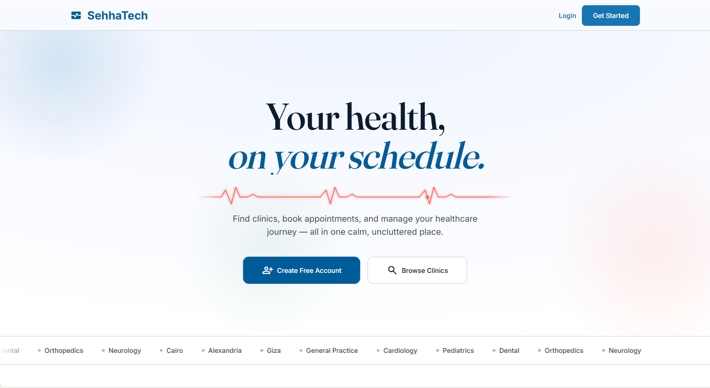

<div align="center">


<br/>


<br/><br/>

<a href="https://git.io/typing-svg">
  
</a>

<br/><br/>

<!-- ════════════ TECH BADGES ════════════ -->


<br/>

<!-- ════════════ DEPLOYMENT BADGES ════════════ -->


<br/><br/>

<!-- ════════════ LIVE REPO STATS ════════════ -->
<a href="https://github.com/abdelrahmanKhalawy/Final-Project-DEPI/stargazers">
  
</a>
<a href="https://github.com/abdelrahmanKhalawy/Final-Project-DEPI/network/members">
  
</a>
<a href="https://github.com/abdelrahmanKhalawy/Final-Project-DEPI/commits/main">
  
</a>
<a href="https://github.com/abdelrahmanKhalawy/Final-Project-DEPI/blob/main/LICENSE">
  
</a>

<br/>


</div>

<br/>

---

## 📸 Screenshots

<div align="center">

### 🖥️ Clinic Management System

<table>
<tr>
<td width="50%">

<p align="center"><b>🏠 Landing Page</b> — Simple, modern & professional</p>
</td>
<td width="50%">

<p align="center"><b>📊 Admin Dashboard</b> — Real-time clinic insights</p>
</td>
</tr>
<tr>
<td width="50%">

<p align="center"><b>📈 Reports & Analytics</b> — Data-driven decisions</p>
</td>
<td width="50%">

<p align="center"><b>📱 Mobile Responsive</b> — Works on any device</p>
</td>
</tr>
</table>

<br/>


<p><b>✨ Everything you need to run your clinic — smarter</b></p>

<br/>

### 🧑‍⚕️ Patient Portal


<p><b>🌐 Patient Portal — <i>"Your health, on your schedule."</i></b></p>

</div>

---

## 📋 Table of Contents

- [🌟 Overview](#-overview)
- [🏗️ Architecture](#-architecture)
- [✨ Features](#-features)
- [🛠️ Tech Stack](#-tech-stack)
- [📁 Project Structure](#-project-structure)
- [🚀 Getting Started](#-getting-started)
- [🌐 Live Demo](#-live-demo)
- [👥 Team](#-team)
- [📄 License](#-license)

---

## 🌟 Overview


**SehhaTech** is a production-ready, enterprise-grade **Healthcare Management Platform** built from scratch as a graduation project for the **Digital Egypt Pioneers Initiative (DEPI) — Full Stack .NET Track, 2025**.

The platform delivers two fully cloud-deployed systems:

- 🏥 **Clinic Management System** — A multi-tenant SaaS platform for clinics to manage their daily operations: patients, doctors, schedules, appointments, and analytics — with strict per-clinic data isolation.
- 🧑‍⚕️ **Patient Portal** — A clean, modern portal where patients can browse clinics, view doctors, and **book appointments online** — no phone calls needed.

<br/>

> 💬 *"Bringing Egyptian clinics and patients closer through smart, scalable technology."*

<br/>

### 📊 Platform at a Glance

<div align="center">

| Metric | Value |
|:-------|:-----:|
| 👥 User Roles | **4** (Super Admin · Clinic Admin · Doctor · Receptionist) |
| 🏗️ Deployed Systems | **2** (Clinic Management + Patient Portal) |
| 📡 REST APIs | **2** (SehhaTech.API + PatientPortal.API) |
| 🔐 Auth Methods | **2** (JWT for staff · OTP for patients) |
| 🐘 Database | **PostgreSQL** — shared, isolated per tenant |
| ☁️ Cloud Deployments | **3** (Railway · Render · Vercel) |
| 📱 Responsive | **Yes** — Desktop · Tablet · Mobile |
| 🌍 City Coverage | Cairo · Giza · Alexandria + more |

</div>

---

## 🏗️ Architecture

SehhaTech is built on a **clean 3-layer architecture** — two independent APIs sharing one PostgreSQL database, with full tenant isolation enforced at the infrastructure layer.

```
╔══════════════════════════════════════════════════════════════════════════╗
║                         🏥  SehhaTech Platform                         ║
╠══════════════════════════════╦═══════════════════════════════════════════╣
║   System 1: Clinic Mgmt     ║       System 2: Patient Portal           ║
║   (Multi-Tenant SaaS)       ║       (Public Self-Service)              ║
╠══════════════════════════════╬═══════════════════════════════════════════╣
║  📡 SehhaTech.API            ║   📡 SehhaTech.PatientPortal.API        ║
║  🖥️  sehhatech-frontend       ║   📱 patient-portal-frontend            ║
╠══════════════════════════════╩═══════════════════════════════════════════╣
║         🧠 SehhaTech.Core   +   🏗️ SehhaTech.Infrastructure            ║
╠══════════════════════════════════════════════════════════════════════════╣
║                       🐘  PostgreSQL Database                           ║
╚══════════════════════════════════════════════════════════════════════════╝

         ☁️ Railway              ☁️ Render              🌐 Vercel
      (Clinic API)           (Portal API)          (Both Frontends)
```

---

## ✨ Features

### 🏥 System 1 — Multi-Tenant Clinic Management

Each clinic subscribes annually and gets **fully isolated** access to their own data — zero leakage between tenants, guaranteed at the infrastructure level.

#### 👤 Role-Based Access Control

<div align="center">

| Permission | 🟣 Super Admin | 🔵 Clinic Admin | 🟢 Doctor | 🟡 Receptionist |
|:-----------|:---:|:---:|:---:|:---:|
| 🏢 Manage Platform & All Clinics | ✅ | ❌ | ❌ | ❌ |
| 💳 Manage Subscriptions & Billing | ✅ | ❌ | ❌ | ❌ |
| ⚙️ Manage Clinic Settings | ✅ | ✅ | ❌ | ❌ |
| 👨‍⚕️ Manage Doctors & Staff | ✅ | ✅ | ❌ | ❌ |
| 📅 Manage Appointments | ✅ | ✅ | ❌ | ✅ |
| 🩺 View Patient Records | ✅ | ✅ | ✅ | ✅ |
| 💊 Write Prescriptions | ❌ | ❌ | ✅ | ❌ |
| 📊 View Dashboard & Reports | ✅ | ✅ | ✅ | ❌ |

</div>

#### 🎯 Core Capabilities

<table>
<tr>
<td width="50%">

**📅 Smart Scheduling**
Doctors define their own availability; receptionists book with real-time conflict detection.

**📊 Real-time Dashboard**
Live stats on appointments, patients, doctors, and more — always up to date.

**💊 Medical Records**
Complete patient history — visits, diagnoses, prescriptions, all in one place.

</td>
<td width="50%">

**🏢 Clinic Onboarding**
Self-registration, annual subscription, and instant access — no setup needed.

**🔒 Full Tenant Isolation**
Every API query is scoped to the clinic — enforced at the infrastructure level.

**📈 Reports & Analytics**
Monthly trends, top doctors, appointment status breakdowns, and new patient growth.

</td>
</tr>
</table>

---

### 🧑‍⚕️ System 2 — Patient Portal

A clean, modern platform for patients to **take control of their healthcare journey** from any device.

<table>
<tr>
<td width="50%">

- 📝 **Quick Sign-Up** — Minimal friction registration
- 🔐 **OTP Authentication** — Passwordless & secure login
- 🔍 **Browse Clinics** — Filter by specialty, city, name
- 📅 **Online Booking** — Pick your doctor, date & time slot

</td>
<td width="50%">

- 📋 **Medical History** — View all past appointments & records
- ↩️ **Token Rotation** — Secure refresh token strategy
- 🌍 **Multi-City Coverage** — Cairo, Giza, Alexandria & more
- 📱 **Mobile-First Design** — Fully responsive on all screens

</td>
</tr>
</table>

---

## 🛠️ Tech Stack

<div align="center">

### 🔵 Backend


### ⚛️ Frontend


### ☁️ DevOps & Tools


</div>

<br/>

<div align="center">

| Layer | Technology | Version | Role |
|:-----:|:----------:|:-------:|:-----|
| 🔵 API Framework | ASP.NET Core | .NET 10 | REST API · Business Logic · Middleware |
| 🧠 ORM | Entity Framework Core | 10 | Code-First · Migrations · Repositories |
| 🐘 Database | PostgreSQL | 16 | Primary Data Store (multi-tenant) |
| 🔐 Auth — Staff | JWT Bearer Tokens | — | Role-based access per clinic |
| 🔑 Auth — Patients | OTP via Email | — | Passwordless patient login |
| ⚛️ Frontend | React + Vite | 18 / 5 | Both Clinic & Patient UIs |
| 🎨 Styling | Tailwind CSS | 3 | Utility-first responsive design |
| ☁️ Backend Hosting | Railway + Render | — | Cloud-managed APIs |
| 🌐 Frontend Hosting | Vercel | — | CDN-optimized static sites |

</div>

---

## 📁 Project Structure

```
📦 Final-Project-DEPI/
│
├── 📁 src/
│   │
│   ├── 🔵 SehhaTech.API/                     # Clinic Management REST API
│   │   ├── 📁 Controllers/
│   │   │   ├── SuperAdminController.cs         # Platform-wide management
│   │   │   ├── DoctorController.cs             # Doctor-facing endpoints
│   │   │   └── ReceptionController.cs          # Reception desk endpoints
│   │   └── Program.cs                          # App config & middleware pipeline
│   │
│   ├── 🧠 SehhaTech.Core/                    # Domain Layer (Framework-free)
│   │   ├── 📁 Entities/                        # Database models
│   │   ├── 📁 Interfaces/                      # Repository & service contracts
│   │   └── 📁 DTOs/                            # Data Transfer Objects
│   │
│   ├── 🏗️ SehhaTech.Infrastructure/          # Infrastructure Layer
│   │   ├── 📁 Repositories/                    # EF Core implementations
│   │   ├── 📁 Migrations/                      # Database migrations
│   │   └── 📁 Services/                        # External & utility services
│   │
│   ├── 🏥 SehhaTech.PatientPortal.API/        # Patient Portal REST API
│   │   ├── 📁 Controllers/                     # Patient-facing endpoints
│   │   └── Program.cs                          # App config
│   │
│   ├── ⚛️  sehhatech-frontend/                # Clinic Management UI
│   │   └── 📁 src/
│   │       ├── 📁 components/                  # Reusable UI components
│   │       └── 📁 pages/                       # Page-level views
│   │
│   └── 📱 patient-portal-frontend/             # Patient Booking UI
│       └── 📁 src/
│           ├── 📁 components/                  # Reusable UI components
│           └── 📁 pages/                       # Page-level views
│
├── 📁 assets/                                  # Logos & media
│   └── 📁 screenshots/                         # App screenshots
├── 📁 database/                                # SQL scripts & seed data
├── 📁 docs/                                    # API documentation
├── 📁 presentation/                            # Slides & demo materials
├── 📄 .gitignore
├── 📄 LICENSE
└── 📄 README.md
```

---

## 🚀 Getting Started

### 📋 Prerequisites

| Tool | Version | Link |
|:----:|:-------:|:----:|
| .NET SDK | 10.0+ | [↗ Download](https://dotnet.microsoft.com/download) |
| Node.js | 18.0+ | [↗ Download](https://nodejs.org/) |
| PostgreSQL | 16+ | [↗ Download](https://www.postgresql.org/download/) |
| Git | Latest | [↗ Download](https://git-scm.com/) |

---

### ⚙️ Backend Setup

**1️⃣ Clone the repository**

```bash
git clone https://github.com/abdelrahmanKhalawy/Final-Project-DEPI.git
cd Final-Project-DEPI
```

**2️⃣ Configure & run the Clinic Management API**

```bash
cd src/SehhaTech.API

dotnet restore

# Edit appsettings.json → update your PostgreSQL connection string:
# "ConnectionStrings": {
#   "DefaultConnection": "Host=localhost;Database=SehhaTech;Username=postgres;Password=YOUR_PASSWORD"
# }

dotnet ef database update
dotnet run   # → https://localhost:5001
```

**3️⃣ Configure & run the Patient Portal API**

```bash
cd ../SehhaTech.PatientPortal.API

dotnet restore
dotnet ef database update
dotnet run   # → https://localhost:5002
```

---

### 🎨 Frontend Setup

**4️⃣ Clinic Management Frontend**

```bash
cd ../../src/sehhatech-frontend

npm install

# Create .env file
echo "VITE_API_URL=http://localhost:5001" > .env

npm run dev   # → http://localhost:5173
```

**5️⃣ Patient Portal Frontend**

```bash
cd ../patient-portal-frontend

npm install

echo "VITE_API_URL=http://localhost:5002" > .env

npm run dev   # → http://localhost:5174
```

---

### 🔧 Environment Variables

| Variable | Where | Description |
|:---------|:-----:|:-----------|
| `VITE_API_URL` | Both frontends | Backend API base URL |
| `ConnectionStrings__DefaultConnection` | Both APIs | PostgreSQL connection string |
| `JWT__SecretKey` | Both APIs | JWT signing secret |
| `JWT__Issuer` | Both APIs | Token issuer |
| `OTP__EmailSender` | PatientPortal API | OTP email sender config |

---

## 🌐 Live Demo

<div align="center">

| System | Platform | Status | Link |
|:------:|:--------:|:------:|:----:|
| 🔵 Clinic Management API | Railway | 🟡 Coming Soon | — |
| 🏥 Patient Portal API | Render | 🟡 Coming Soon | — |
| 🖥️ Clinic Frontend | Vercel | 🟡 Coming Soon | — |
| 📱 Patient Portal | Vercel | 🟡 Coming Soon | — |

> 🚀 *Links will be updated upon deployment. **Star the repo** to get notified!* ⭐

</div>

---

## 👥 Team

<div align="center">

> 🎓 Built with ❤️, late-night ☕, and a lot of `git push` by the **SehhaTech Team**
> — **DEPI Full Stack .NET Track · Egypt 🇪🇬 · 2025**

<br/>

<table>
<tr>
<td align="center">
  <a href="https://github.com/abdelrahmanKhalawy">
    
    <br/><br/>
    <b>Abdelrahman</b>
  </a>
  <br/>
  <sub>🏆 Team Lead & Full Stack Developer</sub>
</td>
<td align="center">
  <a href="https://github.com/maryam-888">
    
    <br/><br/>
    <b>Maryam</b>
  </a>
  <br/>
  <sub>⭐ Backend Developer</sub>
</td>
<td align="center">
  <a href="https://github.com/shahd13-abdalaziz">
    
    <br/><br/>
    <b>Shahd</b>
  </a>
  <br/>
  <sub>⭐ Backend Developer</sub>
</td>
<td align="center">
  <a href="https://github.com/BaherKhedr">
    
    <br/><br/>
    <b>Baher</b>
  </a>
  <br/>
  <sub>⭐ Backend Developer</sub>
</td>
<td align="center">
  <a href="https://github.com/naglashawky">
    
    <br/><br/>
    <b>Naglaa</b>
  </a>
  <br/>
  <sub>⭐ Backend Developer</sub>
</td>
</tr>
</table>

<br/>

### 🤝 All Contributors

<a href="https://github.com/abdelrahmanKhalawy/Final-Project-DEPI/graphs/contributors">
  
</a>

</div>

---

## 📄 License

This project is licensed under the **MIT License** — see the [LICENSE](./LICENSE) file for details.

---

<div align="center">

<br/>

### ⭐ If SehhaTech impressed you — drop a star. It means everything to us. ⭐

<br/>

**Made with ❤️ in Egypt 🇪🇬 by Team SehhaTech**

*Digital Egypt Pioneers Initiative (DEPI) · Full Stack .NET Track · 2026*

<br/>

[](https://forthebadge.com)
[](https://forthebadge.com)
[](https://forthebadge.com)

<br/>


</div>
